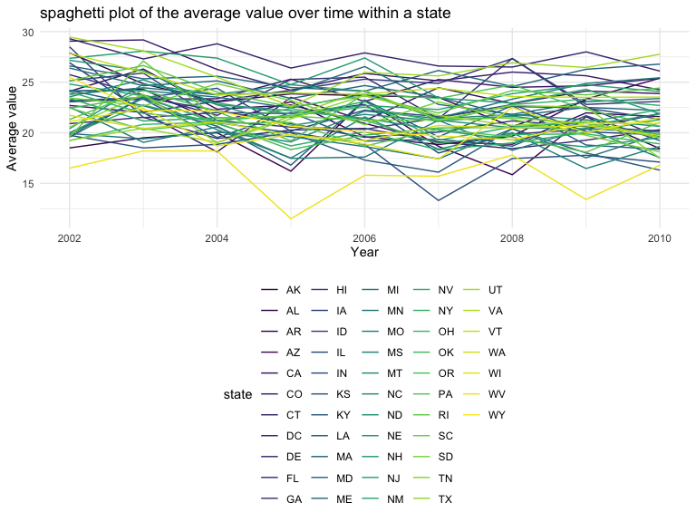
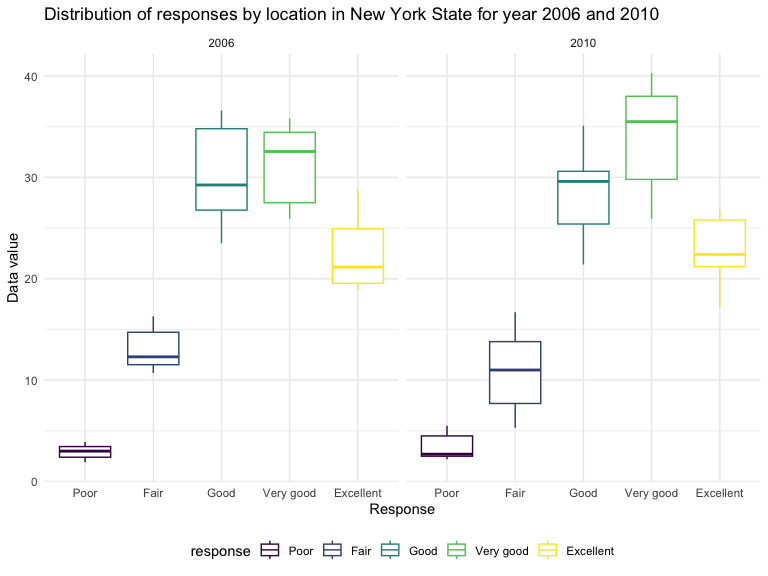
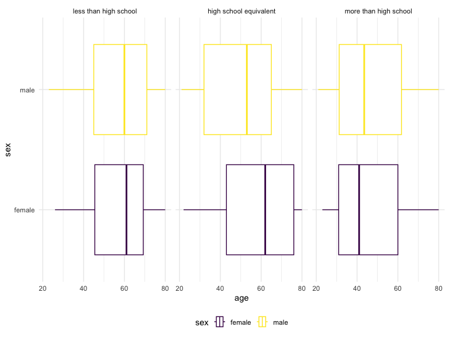
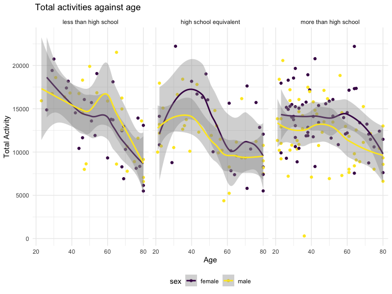
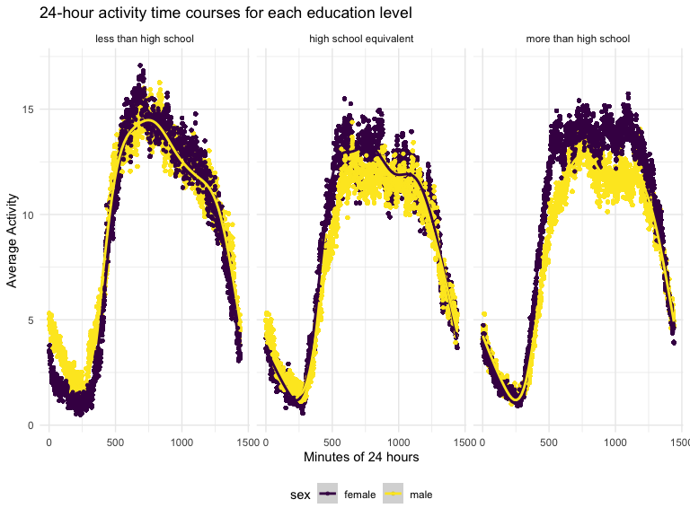

p8105_hw3_yl5214
================

### Problem 1

# Question 1

``` r
library(p8105.datasets)
data("instacart")

knitr::opts_chunk$set(
 echo = TRUE,
 warning = FALSE,
 fig.width = 8, 
  fig.height = 6,
  out.width = "90%"
)

theme_set(theme_minimal() + theme(legend.position = "bottom"))

options(
  ggplot2.continuous.colour = "viridis",
  ggplot2.continuous.fill = "viridis"
)

scale_colour_discrete = scale_colour_viridis_d
scale_fill_discrete = scale_fill_viridis_d
```

### Problem 1

#### Read in the data

``` r
data("instacart")

instacart = 
  instacart |> 
  as_tibble()
```

#### Answer questions about the data

This dataset contains 1384617 rows and 15 columns, with each row
resprenting a single product from an instacart order. Variables include
identifiers for user, order, and product; the order in which each
product was added to the cart. There are several order-level variables,
describing the day and time of the order, and number of days since prior
order. Then there are several item-specific variables, describing the
product name (e.g. Yogurt, Avocado), department (e.g. dairy and eggs,
produce), and aisle (e.g. yogurt, fresh fruits), and whether the item
has been ordered by this user in the past. In total, there are 39123
products found in 131209 orders from 131209 distinct users.

Below is a table summarizing the number of items ordered from aisle. In
total, there are 134 aisles, with fresh vegetables and fresh fruits
holding the most items ordered by far.

``` r
instacart |> 
  count(aisle) |> 
  arrange(desc(n))
```

    ## # A tibble: 134 × 2
    ##    aisle                              n
    ##    <chr>                          <int>
    ##  1 fresh vegetables              150609
    ##  2 fresh fruits                  150473
    ##  3 packaged vegetables fruits     78493
    ##  4 yogurt                         55240
    ##  5 packaged cheese                41699
    ##  6 water seltzer sparkling water  36617
    ##  7 milk                           32644
    ##  8 chips pretzels                 31269
    ##  9 soy lactosefree                26240
    ## 10 bread                          23635
    ## # ℹ 124 more rows

Next is a plot that shows the number of items ordered in each aisle.
Here, aisles are ordered by ascending number of items.

``` r
instacart |> 
  count(aisle) |> 
  filter(n > 10000) |> 
  mutate(aisle = fct_reorder(aisle, n)) |> 
  ggplot(aes(x = aisle, y = n)) + 
  geom_point() + 
  labs(title = "Number of items ordered in each aisle") +
  theme(axis.text.x = element_text(angle = 60, hjust = 1))
```


Our next table shows the three most popular items in aisles
`baking ingredients`, `dog food care`, and `packaged vegetables fruits`,
and includes the number of times each item is ordered in your table.

``` r
instacart |> 
  filter(aisle %in% c("baking ingredients", "dog food care", "packaged vegetables fruits")) |>
  group_by(aisle) |> 
  count(product_name) |> 
  mutate(rank = min_rank(desc(n))) |> 
  filter(rank < 4) |> 
  arrange(desc(n)) |>
  knitr::kable()
```

| aisle                      | product_name                                  |    n | rank |
|:---------------------------|:----------------------------------------------|-----:|-----:|
| packaged vegetables fruits | Organic Baby Spinach                          | 9784 |    1 |
| packaged vegetables fruits | Organic Raspberries                           | 5546 |    2 |
| packaged vegetables fruits | Organic Blueberries                           | 4966 |    3 |
| baking ingredients         | Light Brown Sugar                             |  499 |    1 |
| baking ingredients         | Pure Baking Soda                              |  387 |    2 |
| baking ingredients         | Cane Sugar                                    |  336 |    3 |
| dog food care              | Snack Sticks Chicken & Rice Recipe Dog Treats |   30 |    1 |
| dog food care              | Organix Chicken & Brown Rice Recipe           |   28 |    2 |
| dog food care              | Small Dog Biscuits                            |   26 |    3 |

Finally is a table showing the mean hour of the day at which Pink Lady
Apples and Coffee Ice Cream are ordered on each day of the week. This
table has been formatted in an untidy manner for human readers. Pink
Lady Apples are generally purchased slightly earlier in the day than
Coffee Ice Cream, with the exception of day 5.

``` r
instacart |>
  filter(product_name %in% c("Pink Lady Apples", "Coffee Ice Cream")) |>
  group_by(product_name, order_dow) |>
  summarize(mean_hour = mean(order_hour_of_day)) |>
  pivot_wider(
    names_from = order_dow, 
    values_from = mean_hour) |>
  knitr::kable(digits = 2)
```

    ## `summarise()` has grouped output by 'product_name'. You can override using the
    ## `.groups` argument.

| product_name     |     0 |     1 |     2 |     3 |     4 |     5 |     6 |
|:-----------------|------:|------:|------:|------:|------:|------:|------:|
| Coffee Ice Cream | 13.77 | 14.32 | 15.38 | 15.32 | 15.22 | 12.26 | 13.83 |
| Pink Lady Apples | 13.44 | 11.36 | 11.70 | 14.25 | 11.55 | 12.78 | 11.94 |

#### Read in the data

``` r
library(p8105.datasets)
data("instacart")

instacart = 
  instacart |> 
  as_tibble()
```

#### Answer questions about the data

This dataset contains 1384617 rows and 15 columns, with each row
resprenting a single product from an instacart order. Variables include
identifiers for user, order, and product; the order in which each
product was added to the cart. There are several order-level variables,
describing the day and time of the order, and number of days since prior
order. Then there are several item-specific variables, describing the
product name (e.g. Yogurt, Avocado), department (e.g. dairy and eggs,
produce), and aisle (e.g. yogurt, fresh fruits), and whether the item
has been ordered by this user in the past. In total, there are 39123
products found in 131209 orders from 131209 distinct users.

Below is a table summarizing the number of items ordered from aisle. In
total, there are 134 aisles, with fresh vegetables and fresh fruits
holding the most items ordered by far.

``` r
instacart |> 
  count(aisle) |> 
  arrange(desc(n))
```

    ## # A tibble: 134 × 2
    ##    aisle                              n
    ##    <chr>                          <int>
    ##  1 fresh vegetables              150609
    ##  2 fresh fruits                  150473
    ##  3 packaged vegetables fruits     78493
    ##  4 yogurt                         55240
    ##  5 packaged cheese                41699
    ##  6 water seltzer sparkling water  36617
    ##  7 milk                           32644
    ##  8 chips pretzels                 31269
    ##  9 soy lactosefree                26240
    ## 10 bread                          23635
    ## # ℹ 124 more rows

Next is a plot that shows the number of items ordered in each aisle.
Here, aisles are ordered by ascending number of items.

``` r
instacart |> 
  count(aisle) |> 
  filter(n > 10000) |> 
  mutate(aisle = fct_reorder(aisle, n)) |> 
  ggplot(aes(x = aisle, y = n)) + 
  geom_point() + 
  labs(title = "Number of items ordered in each aisle") +
  theme(axis.text.x = element_text(angle = 60, hjust = 1))
```


Our next table shows the three most popular items in aisles
`baking ingredients`, `dog food care`, and `packaged vegetables fruits`,
and includes the number of times each item is ordered in your table.

``` r
instacart |> 
  filter(aisle %in% c("baking ingredients", "dog food care", "packaged vegetables fruits")) |>
  group_by(aisle) |> 
  count(product_name) |> 
  mutate(rank = min_rank(desc(n))) |> 
  filter(rank < 4) |> 
  arrange(desc(n)) |>
  knitr::kable()
```

| aisle                      | product_name                                  |    n | rank |
|:---------------------------|:----------------------------------------------|-----:|-----:|
| packaged vegetables fruits | Organic Baby Spinach                          | 9784 |    1 |
| packaged vegetables fruits | Organic Raspberries                           | 5546 |    2 |
| packaged vegetables fruits | Organic Blueberries                           | 4966 |    3 |
| baking ingredients         | Light Brown Sugar                             |  499 |    1 |
| baking ingredients         | Pure Baking Soda                              |  387 |    2 |
| baking ingredients         | Cane Sugar                                    |  336 |    3 |
| dog food care              | Snack Sticks Chicken & Rice Recipe Dog Treats |   30 |    1 |
| dog food care              | Organix Chicken & Brown Rice Recipe           |   28 |    2 |
| dog food care              | Small Dog Biscuits                            |   26 |    3 |

Finally is a table showing the mean hour of the day at which Pink Lady
Apples and Coffee Ice Cream are ordered on each day of the week. This
table has been formatted in an untidy manner for human readers. Pink
Lady Apples are generally purchased slightly earlier in the day than
Coffee Ice Cream, with the exception of day 5.

``` r
instacart |>
  filter(product_name %in% c("Pink Lady Apples", "Coffee Ice Cream")) |>
  group_by(product_name, order_dow) |>
  summarize(mean_hour = mean(order_hour_of_day)) |>
  pivot_wider(
    names_from = order_dow, 
    values_from = mean_hour) |>
  knitr::kable(digits = 2)
```

    ## `summarise()` has grouped output by 'product_name'. You can override using the
    ## `.groups` argument.

| product_name     |     0 |     1 |     2 |     3 |     4 |     5 |     6 |
|:-----------------|------:|------:|------:|------:|------:|------:|------:|
| Coffee Ice Cream | 13.77 | 14.32 | 15.38 | 15.32 | 15.22 | 12.26 | 13.83 |
| Pink Lady Apples | 13.44 | 11.36 | 11.70 | 14.25 | 11.55 | 12.78 | 11.94 |

## Problem 2

``` r
library(p8105.datasets)
data("brfss_smart2010")
view(brfss_smart2010)
```

``` r
brfss=brfss_smart2010 |> 
  janitor::clean_names() |> 
  filter(topic=='Overall Health') |> 
  filter(response %in% c('Excellent', 'Very good','Good','Fair','Poor')) |> 
  mutate(
    response= factor(response, levels = c("Poor", "Fair", "Good", "Very good","Excellent"), ordered = TRUE)
  ) |> 
rename(state =locationabbr) |> 
rename(county =locationdesc)
```

## In 2002, which states were observed at 7 or more locations? What about in 2010?

``` r
brfss_2002=brfss |> 
  filter(year=='2002') |> 
  group_by(state) |> 
  summarize(n_obs = n_distinct(county)) |> 
  filter(n_obs>=7)

brfss_2010=brfss |> 
  filter(year=='2010') |> 
  group_by(state) |> 
  summarize(n_obs = n_distinct(county)) |> 
  filter(n_obs>=7)
```

#### Comment: In 2002, 6 states were observed at 7 or more locations. In 2010, 14 states were observed at 7 or more locations.

## Construct a dataset that is limited to Excellent responses, and contains, year, state, and a variable that averages the data_value across locations within a state. Make a “spaghetti” plot of this average value over time within a state (that is, make a plot showing a line for each state across years – the geom_line geometry and group aesthetic will help).

``` r
brfss_excellent=brfss |> 
  filter(response == 'Excellent') |> 
  group_by (year, state) |> 
  summarise(
    average_value= mean(data_value, na.rm = TRUE),
    .groups = 'drop')|> 
  ggplot(aes (x= year, y= average_value, color=state))+
  geom_line()+
    labs(
      title = "spaghetti plot of the average value over time within a state",
       x = "Year",
       y = "Average value") 

brfss_excellent  
```


\#### Comment: Except three states, all other states have average values
that range from about 15 to 30 between year 2002 to 2010. All the states
have the values up and down throughout the 200-2010 peiods. Some of the
states exhibits higher average values like around 25 while others
exhibits the lower average value around 20. The difference of average
value between each state is relatively small.

\##Make a two-panel plot showing, for the years 2006, and 2010,
distribution of data_value for responses (“Poor” to “Excellent”) among
locations in NY State.

``` r
brfss_two=brfss |> 
  filter(
    year %in% c('2010', '2006')
         ) |> 
  filter(state == 'NY') |> 
  group_by (year) |> 
  ggplot(aes (x= response, y= data_value, color= response))+
  geom_boxplot()+
  facet_grid(. ~ year)+  
  labs(
       x = "Response",
       y = "Data value",
       title = "Distribution of responses by location in New York State for year 2006 and 2010"
       )

brfss_two
```


\#### Comment: The distribution of response in year 2016 exhibits the
similar pattern to the distribution of response in year 2010. The
average value for ‘very good’ in 2010 is greater than the average value
for ‘very good’ in 2006. The average value for ‘good’ in 2010 is smaller
than the average value for ‘good’ in 2006.

## Problem 3

\##Load, tidy, merge, and otherwise organize the data sets. Your final
dataset should include all originally observed variables; exclude
participants less than 21 years of age, and those with missing
demographic data; and encode data with reasonable variable classes
(i.e. not numeric, and using factors with the ordering of tables and
plots in mind).

``` r
covar=
  read_csv('data/nhanes_covar.csv', 
           skip =4,
           col_types=
             cols(
               'SEQN'=col_factor()
             ))|> 
  janitor::clean_names() |> 
  filter(age>=21) |> 
  mutate(
    sex= case_match(
      sex,
      1~ 'male',
      2 ~'female'
    )
  ) |> 
  mutate(
    education=case_match(
      education,
      1~'less than high school',
      2~'high school equivalent',
      3~'more than high school'
    )
  ) |> 
  mutate(
    education=forcats::fct_relevel
    (education, c('less than high school', 'high school equivalent', 'more than high school'))) |> 
   na.omit()
```

``` r
accel=
  read_csv('data/nhanes_accel.csv', 
           col_types=
             cols(
               'SEQN'=col_factor()
             ))|> 
  janitor::clean_names() |> 
    pivot_longer(
    min1:min1440,
    names_to = "minute",
    names_prefix = "min",
    values_to = "activity"
  ) |> 
  na.omit() |> 
  mutate(minute = as.numeric(minute))
merge=
  left_join(covar,accel, by = 'seqn')
```

## Produce a reader-friendly table for the number of men and women in each education category, and create a visualization of the age distributions for men and women in each education category. Comment on these items.

``` r
covar |> 
  count(education,sex) |> 
    pivot_wider(
    names_from =sex,
    values_from= n
) |> 
knitr::kable()
```

| education              | female | male |
|:-----------------------|-------:|-----:|
| less than high school  |     28 |   27 |
| high school equivalent |     23 |   35 |
| more than high school  |     59 |   56 |

#### Comment: The number of male and female are similar in less than high school and more than high school category. For high school equivalent education, the number of male and female are very different. The number of male and female in more than high school category are the highest among all three catergories. There is an increasing trend in number of male and female when education level increase.

``` r
merge |> 
  ggplot(aes(x = age, y = sex, color = sex)) + 
  geom_boxplot() + 
  facet_grid(. ~ education)
```



``` r
  labs(
       x = "Age",
       y = "Sex",
      title = "Boxplot plot of age distribution at different education levels")
```

    ## $x
    ## [1] "Age"
    ## 
    ## $y
    ## [1] "Sex"
    ## 
    ## $title
    ## [1] "Boxplot plot of age distribution at different education levels"
    ## 
    ## attr(,"class")
    ## [1] "labels"

#### Comment: The distribution of age for both male and female is similar for category of education less than high school with median age 60. For high school equivalent group, the median age and the overall age distribution of male is younger than the female group. The median age of male is around 50 whereas median age of female is around 60. Finally, For more than high school group, the age distribution and median age of female is relatively younger than those of males.

## Traditional analyses of accelerometer data focus on the total activity over the day. Using your tidied dataset, aggregate across minutes to create a total activity variable for each participant. Plot these total activities (y-axis) against age (x-axis); your plot should compare men to women and have separate panels for each education level. Include a trend line or a smooth to illustrate differences. Comment on your plot.

``` r
merge_aggregate=merge |>
  group_by (seqn,sex,education,age) |> 
  summarize(total_activity = sum(activity)) |> 
  ggplot(aes(x=age , y=total_activity, color= sex))+
  geom_point()+
  geom_smooth()+
  facet_grid(. ~ education)+
  labs(
    x = "Age",
    y = "Total Activity", 
    color = "sex",
    title =" Total activities against age"
    )
```

    ## `summarise()` has grouped output by 'seqn', 'sex', 'education'. You can
    ## override using the `.groups` argument.

``` r
merge_aggregate
```

    ## `geom_smooth()` using method = 'loess' and formula = 'y ~ x'


\#### Comment: For ‘less than high school’ graph, total activity of male
is overall greater than the total activity of female across age 20 to
80. Both male and female have an overall decreasing trendline from age
20 to 80, although total activity of male has a bigger spike from age 40
to 60 with peak activity in age 20. For ‘high school equivalent’ graph,
total activity of female is overall greater than the total activity of
man across age 20 to 80. Both male and female have an overall decreasing
trendline from age 40 to 80, although they both have a slight increase
from age 20 to 40, with the peak in age 40. For ‘more than high school’
graph, total activity of female is overall greater than the total
activity of man across age 20 to 80. Both male and female have an
overall decreasing trendline from age 20 to 80. However, from age 20 to
60, the total activity of female is constant. From age 20 to 40, the
total activity of male is constant.

\##Accelerometer data allows the inspection activity over the course of
the day. Make a three-panel plot that shows the 24-hour activity time
courses for each education level and use color to indicate sex. Describe
in words any patterns or conclusions you can make based on this graph;
including smooth trends may help identify differences.

``` r
plot_merge=merge|>
  group_by(minute, education, sex) |> 
  mutate(avg_activity= mean(activity)) |> 
  ggplot(aes(x=minute, y=avg_activity, color=sex))+
  geom_point(size= 1.0)+
  geom_smooth()+
  facet_grid(.~education)+
     labs(
    x = "Minutes of 24 hours",
    y = "Average Activity",
    color = "sex",
    title = "24-hour activity time courses for each education level"
  )

plot_merge
```

    ## `geom_smooth()` using method = 'gam' and formula = 'y ~ s(x, bs = "cs")'


\####Comment: Regardless of education category and sex, participants
show the same activity pattern around the day. In the morning, the
activity is the lowest among male and female group. The peak activity
level is seen around 750 minutes and plateau for around 300
minutes.Then, the activity level deio significantly in the evening.
Female in ‘more than high school’ category exhibits higher activity
level throughout the day than Male.
