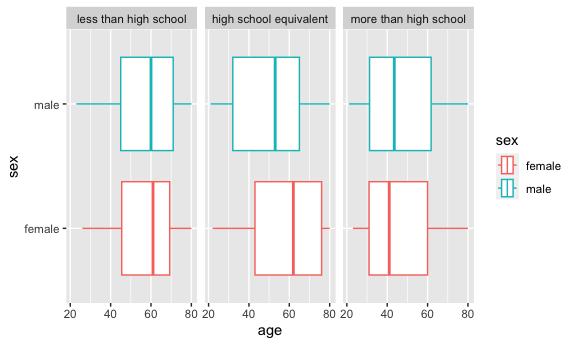

p8105_hw3_yl5214
================

``` r
library(tidyverse)
```

    ## ── Attaching core tidyverse packages ──────────────────────── tidyverse 2.0.0 ──
    ## ✔ dplyr     1.1.3     ✔ readr     2.1.4
    ## ✔ forcats   1.0.0     ✔ stringr   1.5.0
    ## ✔ ggplot2   3.4.3     ✔ tibble    3.2.1
    ## ✔ lubridate 1.9.2     ✔ tidyr     1.3.0
    ## ✔ purrr     1.0.2     
    ## ── Conflicts ────────────────────────────────────────── tidyverse_conflicts() ──
    ## ✖ dplyr::filter() masks stats::filter()
    ## ✖ dplyr::lag()    masks stats::lag()
    ## ℹ Use the conflicted package (<http://conflicted.r-lib.org/>) to force all conflicts to become errors

``` r
knitr::opts_chunk$set(
  fig.width = 6,
  fig.asp = .6,
  out.width = "90%"
)
```

## Problem 2

``` r
library(p8105.datasets)
data("brfss_smart2010")
view(brfss_smart2010)
```

``` r
brfss=brfss_smart2010 |> 
  janitor::clean_names() |> 
  filter(topic=='Overall Health') |> 
  filter(response %in% c('Excellent', 'Very good','Good','Fair','Poor')) |> 
  mutate(
    response= factor(response, levels = c("Poor", "Fair", "Good", "Very good","Excellent"), ordered = TRUE)
  ) |> 
rename(state =locationabbr) |> 
rename(county =locationdesc)
```

## In 2002, which states were observed at 7 or more locations? What about in 2010?

``` r
brfss_2002=brfss |> 
  filter(year=='2002') |> 
  group_by(state) |> 
  summarize(n_obs = n_distinct(county)) |> 
  filter(n_obs>=7)

brfss_2010=brfss |> 
  filter(year=='2010') |> 
  group_by(state) |> 
  summarize(n_obs = n_distinct(county)) |> 
  filter(n_obs>=7)
```

#### Comment: In 2002, 6 states were observed at 7 or more locations. In 2010, 14 states were observed at 7 or more locations.

## Construct a dataset that is limited to Excellent responses, and contains, year, state, and a variable that averages the data_value across locations within a state. Make a “spaghetti” plot of this average value over time within a state (that is, make a plot showing a line for each state across years – the geom_line geometry and group aesthetic will help).

``` r
brfss_excellent=brfss |> 
  filter(response == 'Excellent') |> 
  group_by (year, state) |> 
  summarise(
    average_value= mean(data_value, na.rm = TRUE),
    .groups = 'drop')|> 
  ggplot(aes (x= year, y= average_value, color=state))+
  geom_line()
```

#### Comment:

\##Make a two-panel plot showing, for the years 2006, and 2010,
distribution of data_value for responses (“Poor” to “Excellent”) among
locations in NY State.

``` r
brfss_two=brfss |> 
  filter(
    year %in% c('2010', '2006')
         ) |> 
  filter(state == 'NY') |> 
  group_by (year) |> 
  ggplot(aes (x= response, y= data_value))+
  geom_boxplot()+
  facet_grid(. ~ year)
```

#### Comment:

## Problem 3

\##Load, tidy, merge, and otherwise organize the data sets. Your final
dataset should include all originally observed variables; exclude
participants less than 21 years of age, and those with missing
demographic data; and encode data with reasonable variable classes
(i.e. not numeric, and using factors with the ordering of tables and
plots in mind).

``` r
covar=
  read_csv('data/nhanes_covar.csv', 
           skip =4,
           col_types=
             cols(
               'SEQN'=col_factor()
             ))|> 
  janitor::clean_names() |> 
  filter(age>=21) |> 
  drop_na(bmi) |> 
  drop_na(education) |> 
  mutate(
    sex= case_match(
      sex,
      1~ 'male',
      2 ~'female'
    )
  ) |> 
  mutate(
    education=case_match(
      education,
      1~'less than high school',
      2~'high school equivalent',
      3~'more than high school'
    )
  ) |> 
  mutate(
    education=forcats::fct_relevel
    (education, c('less than high school', 'high school equivalent', 'more than high school')))
```

``` r
accel=
  read_csv('data/nhanes_accel.csv', 
           col_types=
             cols(
               'SEQN'=col_factor()
             ))|> 
  janitor::clean_names() |> 
    pivot_longer(
    min1:min1440,
    names_to = "minute",
    names_prefix = "min",
    values_to = "activity"
  )

merge=
  left_join(covar,accel, by = 'seqn')
```

## Produce a reader-friendly table for the number of men and women in each education category, and create a visualization of the age distributions for men and women in each education category. Comment on these items.

``` r
covar |> 
  count(education,sex) |> 
    pivot_wider(
    names_from =sex,
    values_from= n
) |> 
knitr::kable()
```

| education              | female | male |
|:-----------------------|-------:|-----:|
| less than high school  |     28 |   27 |
| high school equivalent |     23 |   35 |
| more than high school  |     59 |   56 |

#### Comment: The number of male and female are similar in less than high school and more than high school category. For high school equivalent education, the number of male and female are very different. The number of male and female in more than high school category are the highest among all three catergories. There is an increasing trend in number of male and female when education level increase.

``` r
merge |> 
  ggplot(aes(x = age, y = sex, color = sex)) + 
  geom_boxplot() + 
  facet_grid(. ~ education)
```


\#### Comment:

## Traditional analyses of accelerometer data focus on the total activity over the day. Using your tidied dataset, aggregate across minutes to create a total activity variable for each participant. Plot these total activities (y-axis) against age (x-axis); your plot should compare men to women and have separate panels for each education level. Include a trend line or a smooth to illustrate differences. Comment on your plot.

``` r
merge_aggregate=merge |>
  group_by (seqn,sex,education,age) |> 
  summarize(total_activity = sum(activity)) |> 
  ggplot(aes(x=age , y=total_activity, color= sex))+
  geom_point()+
  geom_smooth()+
  facet_grid(. ~ education)+
  labs(
    x = "Age",
    y = "Total Activity", 
    color = "sex",
    title =" Total activities against age"
    )
```

    ## `summarise()` has grouped output by 'seqn', 'sex', 'education'. You can
    ## override using the `.groups` argument.

#### Comment: For ‘less than high school’ graph, total activity of male is overall greater than the total activity of female across age 20 to 80. Both male and female have an overall decreasing trendline from age 20 to 80, although total activity of male has a bigger spike from age 40 to 60 with peak activity in age 20. For ‘high school equivalent’ graph, total activity of female is overall greater than the total activity of man across age 20 to 80. Both male and female have an overall decreasing trendline from age 40 to 80, although they both have a slight increase from age 20 to 40, with the peak in age 40. For ‘more than high school’ graph, total activity of female is overall greater than the total activity of man across age 20 to 80. Both male and female have an overall decreasing trendline from age 20 to 80. However, from age 20 to 60, the total activity of female is constant. From age 20 to 40, the total activity of male is constant.

\##Accelerometer data allows the inspection activity over the course of
the day. Make a three-panel plot that shows the 24-hour activity time
courses for each education level and use color to indicate sex. Describe
in words any patterns or conclusions you can make based on this graph;
including smooth trends may help identify differences.

``` r
merge|>
  group_by (seqn,sex,education) |> 
  ggplot(aes(x=minute, y=activity, color=sex))+
  geom_point(alpha=.5)+
  geom_smooth(aes(group=sex),se=FALSE)+
  facet_grid(.~education)+
     labs(
    x = "24-hour activity Time",
    y = "Activity",
    color = "sex",
    title = "24-hour activity time courses for each education level"
  )
```

    ## `geom_smooth()` using method = 'gam' and formula = 'y ~ s(x, bs = "cs")'


